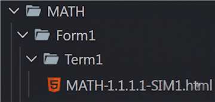

# Developers - How To

This guide covers the shared setup steps plus the developer workflow for taking an issue, setting up files, and committing changes.

# 1. Prerequisites

1. Have Git installed
   - Install Git from [this link](https://git-scm.com/install/)
   - Click through the install, **YOU DO NOT NEED TO CHANGE ANY OPTIONS**
   - Once installed, close any open terminals if you have any open
   - Reopen the terminal (CMD, Powershell, Git Bash, etc.) and run the following command

     ```
     git --version
     ```

     If this returns a version number, Congrats! You have successfully installed Git
     At the time of writing, the current windows git version is "2.54.0.windows.1"

     If there are errors, try running the installer again

- Run the following commands to configure Git with your Github information

  ```
  git config --global user.name "{Put Your Full Name Here}"
  ```

  //example: git config --global user.name "John Doe"

  ```
  git config --global user.email "{Put Your Email Here}"
  ```

  //example: git config --global user.email "johndoe@gmail.com"

2. Have VSCode installed (That is what this guide uses, feel free to use other editors)
   - Install VSCode from [this link](https://code.visualstudio.com/download)
   - Click through the install, **YOU DO NOT NEED TO CHANGE ANY OPTIONS**
   - Launch VSCode and sign into your Github account
   - Install the GitHub Pull Requests extension.
     - Go to the Extensions tab in the sidebar and search for "GitHub Pull Requests" </br>  
     
     - Install the extension
   - Install the Live Preview extension.
     - Go to the Extensions tab in the sidebar and search for "Live Preview" </br>  
     
     - Install the extension

# 2. Cloning The Repository

### NOTE: If you have already done this, SKIP TO THE NEXT STEP.<!-- omit from toc -->

1. Go to where you want to clone the repository, right click within the directory and select **"Open in Terminal"**

   //example: project folder in the Documents Folder


2. Within the terminal, type in

```
git clone --branch templates https://github.com/Tims-Sims/simulations.git
```

3. After cloning, move into the simulations directory

```
cd simulations
```

4. Open in VSCode

```
code .
```

# 3. Switching to Another Branch

You can switch branches both within the terminal and on VSCode. We will go through how to do so on both.

## 3.1. VSCode

1. Go to the "Source Control" tab in the sidebar
   
   
2. Click the three dots (...) within the "CHANGES" bar
   
   
3. Click "Fetch"
   
   

4. Click the button to the left of the "Synchronize" button that shows the name of the current branch you are on, search for the branch name and select it to switch branches


### NOTE: When you start a development session, you should always fetch <!-- omit from toc -->

## 3.2. Terminal

1. The fetch command updates the available branches

```
git fetch
```

2. Now switch branches by using git switch

```
git switch {branch-name}
```

//example: git switch ELAF1T2U4S5

# 4. Pulling Changes

Changes made and pushed by others do not automatically show up, you must pull updates from the repository. This can be for many reasons such as a tester that is currently testing a branch while the developer is making changes

You can pull changes both within the terminal and on VSCode. We will go through how to do so on both

## 4.1. VSCode

1. Use the "Synchronize" button in VSCode


## 4.2. Terminal

1. Pull Changes using the following command

   ```
   git pull
   ```

### NOTE: You should periodically pull, especially if you just switched to the branch <!-- omit from toc -->

# 5. Assigning Yourself to an Issue

1. In the Issues tab in the top bar, click the labels button and in the drop down, select the "dev needed" label to filter only issues that need developers
    
   

2. Once you have selected an issue that needs a developer, click the "assign yourself" button to assign yourself to the issue
   
   
   
3. Remove the "dev needed" label and select the "in progress" label
   
   

4. Now that you have assigned yourself, you can see the Issue thread within the Github Pull Requests extension inside of VSCode
5. Click the Github logo button in the sidebar
   
   

6. In the Issues Section, you can see all issues you are assigned to and can do various things such as seeing the issue name, changing labels and assigning others without leaving VSCode. 
   
   

# 6. File Structure

**ENSURE FILE STRUCTURE IS PRESENT SO THAT THERE WILL BE NO MERGE CONFLICTS**

1. Select the template file you want to use and rename it
2. Delete the other template files
3. Create the file structure **BEFORE** beginning to work  
   > ### File Structure
   >
   > {Subject} -> {Form} -> {Term} -> {Unit} -> [Your HTML File Here]
   > As you can see, the naming convention follows the file structure
   >
   > //example: ELAF1T2U4S5 === ELA => Form1 => Term2 => Unit4 => ELAF1T2U4S5
   >
   > 
   >
   > //example: SSHISTF1T2U4S5 === SS => HIST => Form1 => Term2 => Unit4 => SSHISTF1T2U4S5
   >
   > 

   > ### Maths (MATH) File Structure
   >
   > MATH -> {Form} -> {Term} -> [Your HTML File Here]
   > Maths has NO Unit, Section or Simulation folders — the path stops at the Term folder
   >
   > //example: MATH-1.1.1.1-SIM1 === MATH => Form1 => Term1 => MATH-1.1.1.1-SIM1.html
   >
   > 
   >
   > NOTE: The code does NOT tell you the term — the sim spec / Breakdown Guide tells you which Term folder to use. If it is missing, ask.

### NOTE: You should only have ONE HTML file that you are working on <!-- omit from toc -->

# 7. Committing Changes

You can commit changes both within the terminal and on VSCode. We will go through how to do so on both.

## 7.1. General Information

1. When committing changes, ALWAYS start the commit messages with the issue number, this makes the commit show up within the issue thread.
   //example: #9999 fixed x, y and z

2. Go to the issue and set the label to **review needed**

3. Repeat steps as needed
   
4. While developing, you can see the simulation using the Live Preview extension, right-click the sim file and select the "Show Preview" button
   
   

## 7.2. VSCode

1. Once you have made changes, go to source control in VSCode to see all the files you have changed


2. Stage your changes by clicking the **"+"** buttons, use the **"+"** next to "Changes" to stage all changes

   

3. Type your commit message in the text box and click commit

   

4. Once you have made a commit, you must push your changes by clicking
   "Sync Changes"

   

## 7.3. Terminal

1. Once you are within the code directory, stage your changes

```
git add {file1} {file2}
```

If you do not know what files can be staged, check with

```
git status
```

### OR <!-- omit from toc -->

stage everything using the command

```
git add .
```

2. Once you have staged, commit your changes

```
git commit -m "#{issue number} {comment}"
```

3. Finally, push your changes

```
git push
```

### NOTE <!-- omit from toc -->

If it is your first push on the branch, you should set the upstream with your first push using

```
git push origin {branch-name}
```
